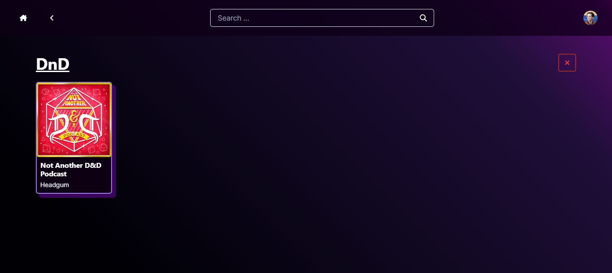

# Podvoyage Frontend

Welcome to the frontend code repository for Podvoyage, a podcast player application. With Podvoyage, you can easily search your favorite podcasts, save it for later, and listen to it. This project utilizes `React` powered by `Next.js` for the framework and complemented by `Chakra UI` component library. The app can adapts seamlessly to both website and mobile environments

## Features
1. **Search your favorite podcast** using iTunes API
    
2. **Subscribe or unsubscribe to podcast** so you can easily access it
    
    
    
3. **Create or remove folder** for organizing your podcasts
    
    
    
    
4. **Play episode from your favorite podcast**. Tailor your experience by adjusting the playback speed and marking episode as played. Also, the app remember your last playback position
    
    

## Getting Started

First, you need to activate the backend. The instruction is available in the [Github repository](https://github.com/airelcamilo/podvoyage-backend)

After that to initiate the development server, execute one of the following commands based on your package manager of choice:

```bash
npm run dev
# or
yarn dev
# or
pnpm dev
```

After starting the development server, launch your browser and navigate to [http://localhost:3000](http://localhost:3000) to access and explore the Podvoyage app.

## Credit
Airel Camilo Khairan © 2023